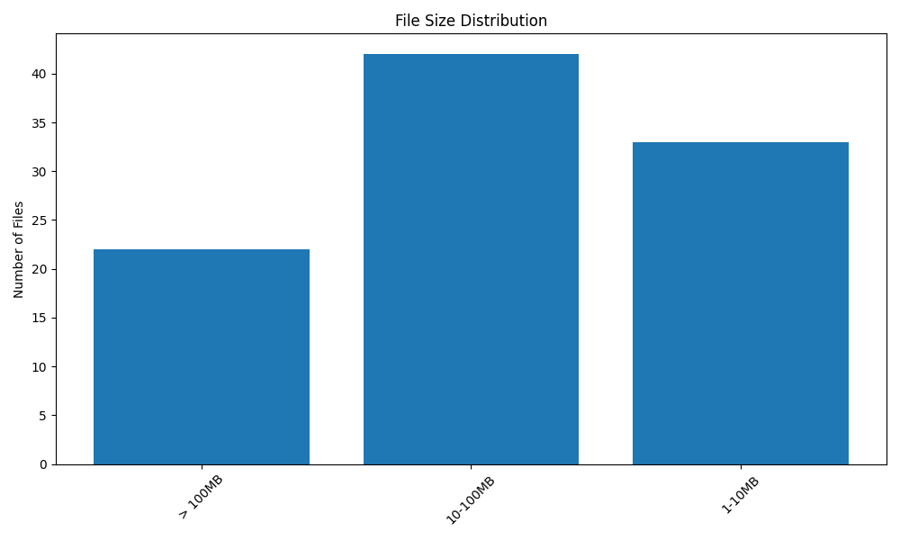

# File System Analysis Report
    Generated on: 2024-11-10 02:17:32

    ## Overview
    - Total Files: 14
    - Total Size: 83.1 MB

    ## File Extensions
    
    - .pdf: 14 files
    

    ## Current Directory Structure
    ```
    └── EM-III_Maths_Notes
    ├── Engineering Mathematics - III Lecture Notes (USK Sir)
    │   ├── 03. Laplace Transform Lecture 3.pdf
    │   ├── 05. Laplace Transform Lecture 5.pdf
    │   ├── 06. Laplace + Inverse Laplace Transform Lecture 6.pdf
    │   ├── 07. Inverse Laplace Transform Lecture 7.pdf
    │   ├── 14. Fourier Series Lecture 3.pdf
    │   ├── 15. Fourier Series Lecture 4.pdf
    │   ├── 16. Fourier Series Online Lecture 5.pdf
    │   ├── 18. Adv Matrix Theory Lecture 2.pdf
    │   ├── 19. Adv Matrix Theory Online Lectures 3, 4 and 5.pdf
    │   ├── 21. Adv Matrix Theory Lecture 7.pdf
    │   ├── 23. Complex Variable Online Lecture 2.pdf
    │   ├── 25. Complex Variable Lecture 4.pdf
    │   └── 26. Complex Variable Lecture 5.pdf
    └── extc
        └── Fourier Transform
            └── fourier transform Solved Examples.pdf

    ```

    ## Proposed Directory Structure
    ```
    └── organized_files
    └── documents
        ├── 03. Laplace Transform Lecture 3.pdf
        ├── 05. Laplace Transform Lecture 5.pdf
        ├── 06. Laplace + Inverse Laplace Transform Lecture 6.pdf
        ├── 07. Inverse Laplace Transform Lecture 7.pdf
        ├── 14. Fourier Series Lecture 3.pdf
        ├── 15. Fourier Series Lecture 4.pdf
        ├── 16. Fourier Series Online Lecture 5.pdf
        ├── 18. Adv Matrix Theory Lecture 2.pdf
        ├── 19. Adv Matrix Theory Online Lectures 3, 4 and 5.pdf
        ├── 21. Adv Matrix Theory Lecture 7.pdf
        ├── 23. Complex Variable Online Lecture 2.pdf
        ├── 25. Complex Variable Lecture 4.pdf
        ├── 26. Complex Variable Lecture 5.pdf
        └── fourier transform Solved Examples.pdf

    ```

    ## Size Distribution
    

    ## Organization Analysis
    
    ### Small Files:
    
    
    
    ### Medium Files:
    
    - 03. Laplace Transform Lecture 3.pdf
    
    - 05. Laplace Transform Lecture 5.pdf
    
    - 06. Laplace + Inverse Laplace Transform Lecture 6.pdf
    
    - 07. Inverse Laplace Transform Lecture 7.pdf
    
    - 14. Fourier Series Lecture 3.pdf
    
    
    ... and 9 more
    
    
    ### Large Files:
    
    
    
    